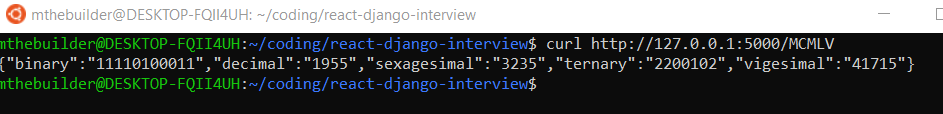

I created a simple API with Flask. I've always built things in Django before, but I felt it would've been way overkill for a simple API request with no database connection. Flask is super easy to set up on the other hand.

The API has a single endpoint with the relative path of `/<roman_numeral>`. Upon a GET request, it will return an object that meets the specs of the problem.

I created 2 functions that helped me generate the object:
1. `r2d` from `roman2decimal.py` - converts a Roman numeral string to a decimal value in `int`
2. `bc` from `base_convert.py` - converts a decimal value to any other base that's been input

I import these 2 functions into `app.py` that serves as the API's main file.
